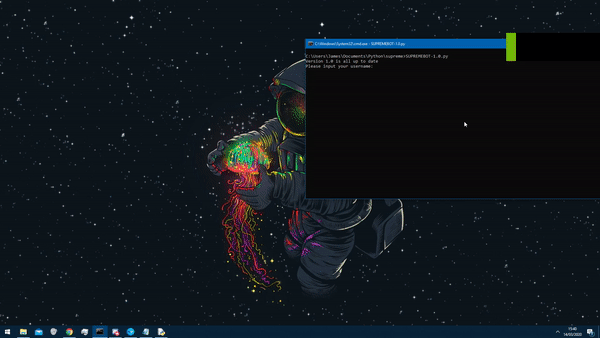

# SupremeBot
Buys items from supreme quickly using selenium, with auto-updating feature
## How to use
1. Read instructions.txt
2. Fill out checkoutdetails.txt with info
3. Put the items in the itemdetails.txt accuratly
4. Run the .py file
5. Type the time you want it to run, do 0 if its for the new drop
## Example
Heres a quick gif to show you how it works

For one item with good wifi the bot can get it in aprox 4.5 seconds
## Limitations
1. Because it uses selenium the speed it buys the product heavily depends on your internet and computer speed
2. Not as fast as bots that use other methods
3. Captchas take longer because supreme are suspicios of the speed of selecting items
4. Item names must be very accurate and if there are two items that have simular names sometimes the wrong item is bought
